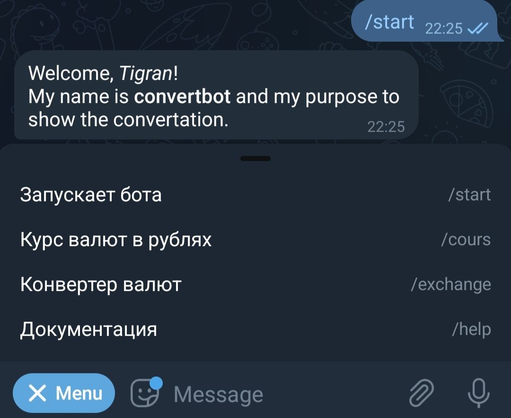
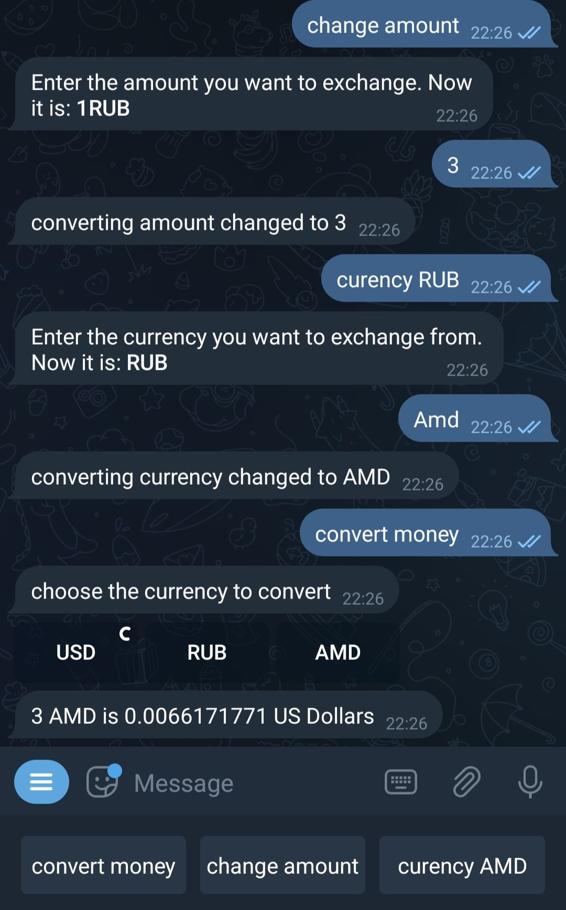

CHANGE_BOT
===

this bot changes the given amount from one currency to another, 
it also prints the one-to-one exchange rate of several foreign currencies in rubles.

1) *__MENU__*


----
```
you must select one of the items in the menu to continue.  exchange for conversion, cours for displaying the exchange rate to the ruble.
```

2) *__COURS__*


----
```
here is the chat when choosing courses
```

3) *__CONVERTING__*


----
```
you must specify the amount of the transferred amount in the change amount by standard it is 1 and indicate the currency from which you are transferring.  Next, click on convert money and choose which currency we are transferring to.example shown on screen
```

INSTALATION
===

By default, you don't need to install it on your machine. You can simply write to telegram bot @teagadbot. But if you need to put it on your machine you need to clone it:

    git clone https://github.com/teagad/change_bot.git

Then you need to go to cloned directory and change the branch

    cd change_bot
    git checkout dev

On the branch dev you need to pip install two modules

    pip install -r requirements.txt

And after this you can finally launch it:

    python3 main.py 

or you can run it by bash script

    ./run.sh(dont forget to write your bot token into that script)